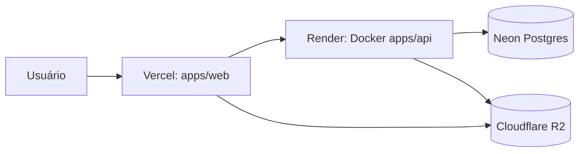

# Deploy — Bomberman Club

Stack **100% gratuita** (free tier perene):

| Camada | Provider | URL / limite |
| --- | --- | --- |
| Frontend (Next.js) | Vercel Hobby | `https://bomberman-web.vercel.app` |
| Backend (Elysia/Bun Docker) | Render Free | `https://bomberman-api-s4ix.onrender.com` |
| Postgres | Neon | 3 GB storage, auto-suspend |
| Storage S3 | Cloudflare R2 | 10 GB + 0 custo de egress |



> **Trade-off Render Free:** o serviço hiberna após ~15 min sem tráfego. A primeira requisição após inatividade leva **30–60 s** (cold start). Aceitável para uso entre amigos; custo **R$ 0,00**.

---

## Pré-requisitos

- Conta GitHub com o repo `hitmain13/bomberman-club`
- Conta [Neon](https://neon.tech) (Postgres)
- Conta [Cloudflare](https://dash.cloudflare.com) com R2 ativo
- Conta [Render](https://render.com) (sem cartão no free tier)
- Conta [Vercel](https://vercel.com) Hobby

---

## 1. Neon — Postgres

1. Criar projeto `bomberman-club` (região `sa-east-1` ou `us-east-2`).
2. Copiar `DATABASE_URL` (`postgresql://...?sslmode=require`).
3. Rodar migrations e seeds (local ou CI):

```bash
cd apps/api
DATABASE_URL='...' bun run db:migrate
DATABASE_URL='...' bun run db:seed
DATABASE_URL='...' bun run db:seed:users
```

Usuários de produção (seed):

| Username | Senha | Role |
| --- | --- | --- |
| `hitmain13` | `Onboard@8723` | ADMIN |
| `matsu-bombermanclub` | `Onboard@8723` | USER |

---

## 2. Cloudflare R2 — uploads

1. Criar bucket `bomberman-uploads`.
2. Habilitar **Public access** → copiar URL pública (`https://pub-....r2.dev`).
3. Criar **API token** (Object Read & Write, bucket específico).
4. Anotar:

```
S3_ENDPOINT=https://<accountId>.r2.cloudflarestorage.com
S3_REGION=auto
S3_ACCESS_KEY_ID=...
S3_SECRET_ACCESS_KEY=...
S3_BUCKET=bomberman-uploads
S3_PUBLIC_BASE_URL=https://pub-....r2.dev
```

5. CORS: aplicar `docs/r2-cors.json` no bucket (permite `*.vercel.app`).

---

## 3. Backend — Render (Docker)

O repo inclui `render.yaml` e `apps/api/Dockerfile` (multi-stage Bun + Prisma Neon adapter).

### Opção A — Dashboard (Blueprint)

1. [Deploy to Render](https://render.com/deploy?repo=https://github.com/hitmain13/bomberman-club)
2. Preencher env vars marcadas `sync: false` no blueprint.
3. JWT secrets: usar `generateValue: true` no `render.yaml`.

### Opção B — API / CLI

```bash
# Login (uma vez)
render login

# Ou script auxiliar (requer RENDER_API_KEY)
RENDER_API_KEY=rnd_... ./scripts/render-deploy.sh
```

**Env vars obrigatórias no serviço `bomberman-api`:**

| Variável | Exemplo |
| --- | --- |
| `DATABASE_URL` | Neon connection string |
| `API_BASE_URL` | `https://bomberman-api-s4ix.onrender.com` |
| `WEB_ORIGIN` | `https://bomberman-web.vercel.app` |
| `JWT_ACCESS_SECRET` / `JWT_REFRESH_SECRET` | 64+ chars (Render pode gerar) |
| `S3_*` | Credenciais R2 |
| `COOKIE_SECURE` | `true` |
| `COOKIE_DOMAIN` | *(vazio — cross-origin)* |
| `REDIS_URL` | *(vazio — opcional)* |

**Health check:** `GET /health` → `{"ok":true,"service":"bomberman-api"}`

**Docker local (smoke test):**

```bash
docker build -f apps/api/Dockerfile -t bomberman-api .
docker run -p 3333:3333 --env-file .env.production bomberman-api
```

---

## 4. Frontend — Vercel

1. Importar repo → projeto `bomberman-web`.
2. **Root Directory:** `apps/web`
3. **Install:** `cd ../.. && bun install --frozen-lockfile --ignore-scripts`
4. **Build:** `cd ../.. && bun install --frozen-lockfile --ignore-scripts && cd apps/web && bun run build`
5. Env de produção:

```
NEXT_PUBLIC_API_URL=https://bomberman-api-s4ix.onrender.com
```

6. Deploy:

```bash
cd /caminho/do/repo
vercel link --project bomberman-web
vercel deploy --prod
```

> **Next.js:** usar versão patched (ex.: `15.1.9+`) — a Vercel bloqueia deploys com CVE-2025-66478.

---

## 5. CORS e cookies

- `WEB_ORIGIN` no Render deve ser a URL **final** da Vercel (inclui preview `*.vercel.app` via config no código).
- `COOKIE_SECURE=true` + `sameSite: none` quando cross-origin (Render ↔ Vercel).
- Após deploy do frontend, atualizar `WEB_ORIGIN` no Render se a URL mudar.

---

## 6. Validação pós-deploy

```bash
API=https://bomberman-api-s4ix.onrender.com
WEB=https://bomberman-web.vercel.app

curl "$API/health"
curl -X POST "$API/auth/login" -H "Content-Type: application/json" \
  -d '{"identifier":"hitmain13","password":"Onboard@8723"}'
curl -I "$WEB/login"
curl -I "$WEB/admin"
```

Checklist manual:

- [ ] Login admin (`hitmain13`) e usuário (`matsu-bombermanclub`)
- [ ] Criar carro com foto (upload R2)
- [ ] Criar flagrado
- [ ] Acessar `/admin` (painel de moderação)

---

## Por que não Vercel para o backend?

Tentativas de rodar Elysia/Bun como serverless na Vercel falharam com `FUNCTION_INVOCATION_FAILED` — problema conhecido do runtime Bun beta em monorepos ([Elysia #1789](https://github.com/elysiajs/elysia/issues/1789)). O backend roda em **Docker no Render**, estável e gratuito.

---

## URLs de produção (atual)

| Serviço | URL |
| --- | --- |
| Web | https://bomberman-web.vercel.app |
| API | https://bomberman-api-s4ix.onrender.com |
| R2 público | https://pub-708b29b443fd4fe3b42885b52abb5040.r2.dev |
