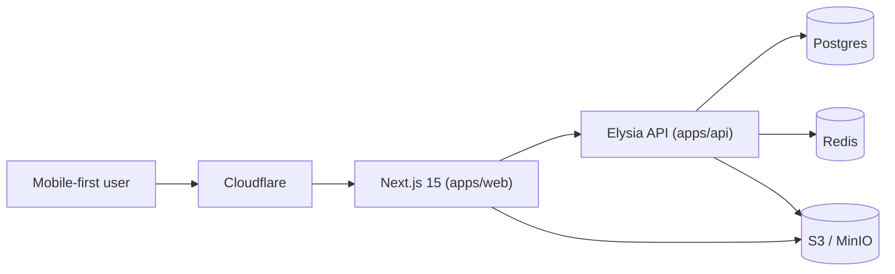

# Bomberman Club — Architecture

Documento canônico de arquitetura. Para regras operacionais ver `.cursor/rules/*` e `.ai/rules/*`. Para decisões individuais ver `docs/architecture/adr/*`.

## Visão geral

Rede social para entusiastas automotivos. Cada usuário monta seu perfil, cadastra carros com peças e specs, publica flagrados com geolocalização, e interage socialmente (follow, like, comment, favorite).



## Monorepo

```
apps/
  web/       Next.js 15, React 19, Tailwind v4
  api/       Elysia, Prisma, Postgres, Redis
packages/
  ui/        atoms compartilhados
  design-tokens/
  types/     zod schemas + tipos + utils de cálculo
  sdk/       client tipado da API
  config/    tsconfig.* + biome compartilhados
```

## Bounded contexts

- Identity & Access
- Garage (garages + cars + car images)
- Configurability (specifications EAV + parts reaproveitáveis)
- Sightings
- Social (comments, likes, favorites, follows, notifications)
- Discovery (feed, search, map, ranking)
- Media (uploads)

## Princípios

- Type-safety ponta a ponta (Zod → DTO → Prisma → Mapper → SDK → consumidor).
- Server Components por padrão.
- Atomic Design no front.
- Clean Architecture no back.
- EAV puro para specs do carro (escalabilidade sem migration).
- Polimorfismo controlado para social (like/comment/favorite genéricos).
- Reuso de `Upload` para qualquer mídia.
- Pixel-perfect com o `wireframe.png` mobile-first 375px.

## Roadmap (SDD)

1. `001-auth` — Splash, Login, Registro, Recuperar senha.
2. `002-profile` — visualizar/editar perfil próprio e de terceiros.
3. `003-garage` — múltiplas garagens, garage primary.
4. `004-cars` — CRUD de carros (campos tipados + galeria).
5. `005-specs-parts` — EAV de specs + peças reaproveitáveis.
6. `006-uploads` — presigned URL + magic-number + sharp.
7. `007-sightings` — flagrados (foto + geo + descrição).
8. `008-map` — mapa com pins e filtros.
9. `009-feed` — Para você / Seguindo / Recentes.
10. `010-social` — comments, likes, favorites, follows.
11. `011-notifications`.
12. `012-ranking` — mais potência, melhor peso/potência, etc.
13. `013-search` — busca multi-recurso.
