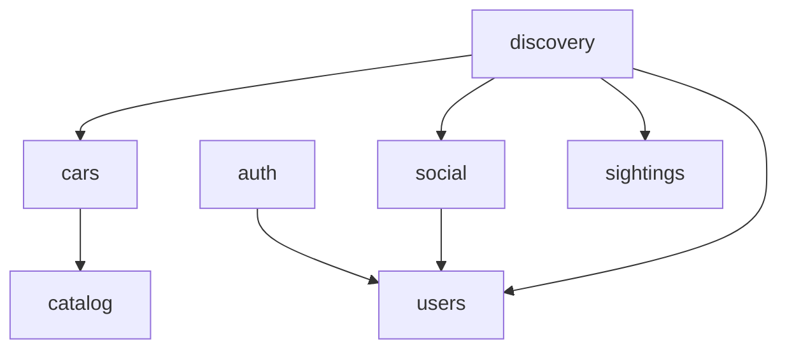

# ADR 0008 — Explore Social: Discovery como camada de leitura cross-context + correções de layering

## Contexto

A feature 013 (Explorar → navegação social entre membros e carros) exigia agregar dados de três bounded contexts diferentes (Identity & Access, Garage, Social) em views de leitura novas: listagem de pessoas com contadores sociais, listagem de carros com dono embutido, e estatísticas completas de perfil (carros, flagrados, seguidores, seguindo, curtidas recebidas).

Durante a auditoria de reutilização (mandatória antes de criar qualquer código novo), identificamos:

1. Os services `feed.service.ts`, `ranking.service.ts` e `search.service.ts` (módulo `discovery`) acessavam `prisma` diretamente, violando a regra do projeto "Controller → Service → Repository, nunca acessar Prisma direto fora do Repository" (`.cursor/rules/20-clean-architecture.mdc`).
2. O mesmo acontecia em `social/services/follows.service.ts`, `social/services/target-owner.service.ts` e `auth/services/auth.service.ts`.
3. Colocar os novos serviços de estatística de perfil (`ProfileStatsService`) e itens curtidos (`LikedItemsService`) dentro do módulo `users` criaria uma dependência circular: `users → social` (para follows/likes) e `social → users` (já existente, para resolver username → user).

## Decisão

### 1. Corrigir todas as violações de acesso direto ao Prisma fora de Repository

- `discovery`: novo `DiscoveryRepository` concentra todo acesso Prisma usado por `feed`, `ranking`, `search` e pelos dois novos services (`explore-people`, `explore-cars`). Os três services antigos foram refatorados para consumir o repository, sem mudança de comportamento (mesmos testes/contratos).
- `social/services/follows.service.ts`: `findUserIdByUsername` local passou a usar `usersRepository.findByUsername`.
- `social/services/target-owner.service.ts`: as 3 resoluções de dono (`PROFILE`/`CAR`/`SIGHTING`) passaram a usar `usersRepository.findById`, `carsRepository.findOwnerId` (novo) e `sightingsRepository.findOwnerId` (novo).
- `auth/services/auth.service.ts`: `loadAvatarUrl` local foi removido em favor de `usersRepository.findAvatarUrl` (método idêntico já existia).

### 2. Grafo de dependências entre módulos (documentado explicitamente)

Regra derivada (nova, adicionada a `.cursor/rules/20-clean-architecture.mdc`): **módulos de domínio (`users`, `cars`, `social`, `sightings`, `garages`, `catalog`) nunca importam de `discovery`**. `discovery` é a única camada permitida a agregar repositórios de múltiplos módulos — é o "read-model layer" da aplicação (mais próximo de CQRS read-side do que um bounded context próprio).

Consequência prática desta ADR: `ProfileStatsService` e `LikedItemsService` foram implementados dentro de `modules/discovery/services/`, não em `modules/users/` ou `modules/social/`, mesmo que suas rotas HTTP fiquem em `/users/:username/stats` e `/users/:username/likes` (registradas por um controller próprio do módulo `discovery`, `userProfileExtrasController` — o mesmo padrão já usado por `userCarsController`/`userSightingsController`, que também registram rotas sob `/users/:username/*` a partir de outro módulo).

### 3. EAV valida a própria premissa do ADR 0002

O filtro "Carros por Stage" no Explorar é resolvido com um `some` sobre `CarSpecificationValue` filtrando `definition.key = "stage"` — nenhuma coluna nova, nenhuma migration. Confirma na prática a promessa original do EAV: "quer adicionar um filtro por spec nova? Só usar a mesma forma de join, sem migration."

### 4. Escopo negativo: banner de perfil e "último acesso"

Avaliados e **descartados nesta rodada**:

- **Banner de perfil**: mencionado no texto do pedido de feature, mas ausente em ambos os wireframes pixel do projeto (o `wireframe.png` original de 21 telas e o wireframe suplementar desta feature). A regra `.cursor/rules/50-pixel-perfect.mdc` é hard-rule; implementar um campo sem tela que o exiba ou edite seria especulativo e geraria uma migration (`User.bannerUploadId`) sem consumidor real.
- **Último acesso**: exigiria (a) tracking de presença (touch em cada request autenticada) e (b) uma configuração de privacidade ("quando permitido") que não existe no produto — abriria escopo não pedido (tela de configurações de privacidade). Fica registrado como candidato a V1.1 em `.progress/todo.md`.

Ambos podem ser adicionados depois seguindo exatamente o padrão já validado de `avatarUploadId` (upload reutilizável + coluna nullable), sem qualquer refactor.

### 5. Ordenação de Pessoas: apenas RECENT e FOLLOWERS

`PeopleSortSchema` foi definido como `RECENT | FOLLOWERS` (sem `CARS`). Ordenar por "mais carros" exigiria agregar contagem de carros via `Garage → Car` (dois hops) diretamente no `ORDER BY` do Postgres, o que o Prisma não suporta nativamente para relações indiretas — só seria viável com SQL raw ou uma coluna desnormalizada, ambos desproporcionais ao benefício. Mantido fora do escopo para não entregar uma ordenação "quebrada" ou inconsistente com paginação por cursor.

## Consequências

- Zero migrations nesta feature; 100% das novas capacidades vêm de agregação Prisma (`_count`, `groupBy` implícito via `Map`, filtros polimórficos, join EAV) sobre o schema de M2.
- Dívida técnica de layering (Prisma fora de Repository) foi **zerada** em todo o backend, não apenas nos arquivos tocados por esta feature — auditoria completa via `grep` confirmou que os únicos arquivos que importam `@/database/prisma` fora de um `*.repository.ts` eram exatamente os 3 corrigidos aqui (mais os 3 do `discovery` já refatorados).
- Módulo `discovery` ganha um papel arquitetural explícito e documentado (read-model/aggregation layer), reduzindo a chance de decisões futuras reintroduzirem acesso direto ao Prisma em services de domínio.
- `BottomSheet` (organism) extraído do `LocationPicker` (M9) elimina duplicação de markup e se torna a base de `PeopleFiltersSheet` e `CarsFiltersSheet` — qualquer filtro futuro reaproveita o mesmo primitivo.
